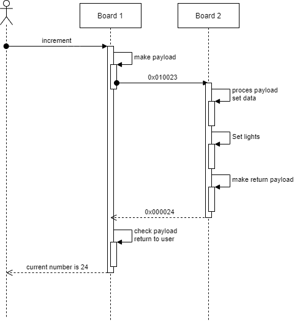

# Led App

## pinout and functions of NRF24L01

| PIN number | Arduino connection | function                                                                                                          |
|------------|--------------------|-------------------------------------------------------------------------------------------------------------------|
| 1          | GND                | GND: this provides the ground to the nrf this is needed so the reference voltage for the control signals is known |
| 2          | Ioref              | VCC: This is providing the power to the chip for it to turn on this needs to be 3.3V                              |
| 3          | D9                 | CE: Chip enable is the pin that manages whether the chip should listen to the SPI commands send                   |
| 4          | D10                | CSN: is the chip select not pin this pin is used to enable the spi bus                                            |
| 5          | D13                | SCK: Serial clock provides the clock pulse for the spi communication to work                                      |
| 6          | D11                | MOSI: Master out slave in pin this is the input pin for data from the microcontroller to the NRF                  |
| 7          | D12                | MISO: Master in slave out pin this is the output pin for data drom the nrf to the microcontroller                 |
| 8          | D7                 | IRQ: This is the inrerrupt pin an wil be active low when triggerd                                                 |

## packet definition

The data that needs to be transported between the two radio's is the following:
should i go to the next pin, should i go the previous pin, and what pin am I on?
This data can be fit into 3 variables so 3 bytes. The packet would look
something like this:

|             | Next | previus | current pin |
|-------------|------|---------|-------------|
| Packet data | 0x00 | 0x01    | 0x01        |
| Values      | 0    | 1       | 1           |

So, this packet tells you need to go back one pin and the current pin is 1. So,
a packet containing 0x010003 would be go to next pin current pin is 3.

## communication beween the boards

The boards would send a package
described above to the other board and increment or decretent the pointer value
given in the packet this packet would sync the boards if there was a discrepancy
between them. This is shown in the picture below.

## Implementation

During the implementation of this project, we stumbled on a few roadblocks the
code that was provided in the assignment was out of date and would not compile a
few days where spend on trying to get this code to work and we did not get it
running. We have tried platform IO to compile it the browser-based IDE and their
own IDE but the sample code did not work. Then we tried working with the
MCP23508 and while we could get LEDs to light up. After a few nights work we did
not get the interrupts working not on the Nucleo or on a Arduino UNO which was
used for sanity checking our way of thinking. We also ran into the issue with
the interrupts during the microcontrollers course. Where we did not get the
interrupts to work.

During the implementation for the radio communication, we did not get any
communication with the radios via the STM. We tried example code, tried
different radios we had some new ones laying around. All with no luck we know
the radios were in working condition since we tested them with an Arduino before
and the communication worked there. We decided to keep working on this while we
started work on the other assignment. This so if we get it working on the other
assignment, we could use this knowledge to fix the problems we were facing here.
