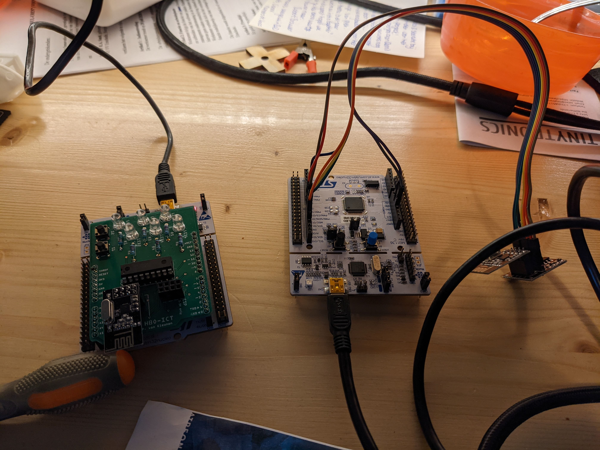

# NRF24L01+ documentation

## General	questions

1. **What is the maximum output power from the NRF24 module?**   
	- 0 dBm [2]
	1. **How does that compare to the output power of a 3G/4G mobile phone?**
		- Between 0 and 30 dBm [1]

2. **What is a frequency band?**
	* The operating frequencys that a device works in.

3. **Which frequency bands can be used by this radio? (check the datasheet)**
	* From 2.400GHz to 2.525GHz [2]
	1. **Which bands are used by WiFi and Bluetooth?**
		- Wifi: 2401 MHz to 2495 MHz [3]
		- Bluethooth: 2400 to 2483.5 MHz [4]
	2. **Where does the NRF24 overlap with these bands?**
		- From stat to  finnish only the 5G wifi is not overlapped

4. **What is the wavelength in meters for the used NRF24 frequency band?**
	- 300.000.000 / 2.400.000.000 = 0.125m
	- 300.000.000 / 2.483.500.000 = 0.120m

5. **Which data rates does the radio support?**
	- 250kbps, 1Mbps and 2Mbps [2]

6. **How many channels does the radio support?**
	- 126 channels so 8 bit [2]
	1. **What is the relationship between channels and frequencies?**
		- F0= 2400 + RF_CH MHz you add the channel to 2400 and you get the frequency [2]

7. **Which modulation technique does the radio use? Explain how this modulation technique works in your own words.**	
	- GFSK: Gaussian frequency shift keying is a modulation method for digital communication. it uses a Gaussian filter before the signal is send. FSK is the input in this system this is modulation where the frycuentcy of a signal is changed depending if the bit is a 1 or 0
 
8. **Power consumption in the idle mode states (power-down, standby-I and standby-II). Explain in your own words what the different states do.**
	- power-down: 900nA, this mode has the radio turned off so only the standby of the chip is used
	- standby-I: 26µA, this mode reduces power by running the radio in a half turned off way
	- standby-II: 320µA, the same mode as standby-i but with extra buffers so the startup time is lower

9. **Power consumption in the transmit state at the four different output levels.**
	- 0dBm output power: 11.3 mA
	- -6dBm output power: 9.0 mA
	- -12dBm output power: 7.5 mA
	- -18dBm output power: 7.0 mA
10. **Power consumption in the receive mode state for the three different air data rates.**
	- Supply current 2Mbps: 13.5 mA
	- Supply current 1Mbps: 13.1 mA
	- Supply current 250kbps: 12.6mA

11. **What is Enhanced ShockBurst and what are the most important functions? Describe this in your own words.**
	- Enhanced ShockBurst (ESB) is a protocol supporting two way data transfer it takes care of importend features such as retransmission, buffering, packet acknowledgment.

12. **On what layer in the ISO/OSI model does this operate?**
	- layer 2

13. **Look at the format of the radio packet (section 7.3 on page 28 of the datasheet) and describe the function of the following fields:**
	- Address: addres of the reciever this is for what radio the packet is ment
	- PID (Packet Identification): this part contains all the meta data of the packet like the legth of the payload, packet information (is it a retransmit or not)
	- No acknowledgement flag  should it send a ack back to the sender this so it knows you got the message
	- CRC: this is a checksum bytes these are set by means of a calculation 

14. **Enhanced ShockBurst is able to automatically validate a packet. Describe how this process works in your own words. Give an example of a packet that is broken and describe how the radio is able to detect this.**
	- before transmission the CRC bytes are calcculated by the radio this is done over the hole packet exept the crc bytes this is than recalculated at the receving end and checked, if the bytes dont match you can detect that the transmission was not succesfull.

15. **What conditions define a good address (see section 7.3.2 of thedatasheet)? Give an example of a good 5-byte address that adheres to these conditions. Write the address in hexadecimal and binary format.**
    - Adresses with more than one level shift and no continuation of the preamble can be considered good addresses.
    - 0x313D371F2F, 0011 0001 0011 1101 0011 0111 0001 1111 0010 1111

16. **Give an example of a bad 5-byte address and explain why this is not a good address. Write the address in hexadecimal and binary.**
    - 0x000FFFFFFF, 0000 0000 0000 1111 1111 1111 1111 1111 1111 1111
    - Only one level shift

17. **Find on the internet what the cost / price (high and low) is of this module.**
    - Zeer goedkoop, rond de €0,56 ex verzenden uit china [5] en €2,50 ex verzenden uit nederland [6].

18. **Findthree alternative radiomodules or shields and for each module**
    1. **RFM69HW [7]**
        - What technique is used for communication: FSK, GFSK, MSK, GMSK, OOK modulations, make your own protocol
        - What is the cost of the shield / module: €4,75
        - What software is available for this module / shield: Arduino library
    2. **HC-05 [8]**
        - What technique is used for communication: Bluetooth
        - What is the cost of the shield / module: €6,00
        - What software is available for this module / shield: Arduino library
    3. **433MKIT [9]**
        - What technique is used for communication: AM, make your own protocol
        - What is the cost of the shield / module: €2,50
        - What software is available for this module / shield: Arduino library

19. Add a table to you report that describes the name and the function of every NRF24 pin. Include to which pin of the Arduino Uno header the NRF24 pin is connected.
	- See [nRF24L01+ pinout table](#nRF24L01+-pinout-table)

20. **The Hello World! example has the TX and RX address configured to a default value. What do you think would happen If a classroom full of students would start using the same address?**
    - Huilen. Due to interference most messages will not be transmitted properly.

21. **Have a look at the method ‘setRegister’. This method is used quite often in the library. What is the function of this method and what is happening in the radio when this function is called?**
    - The radio is configured and controlled using registers. Every register has a address and controls a diferent setting. This method sets the value of a register and therefore configures the radio.

22. **At the top of the .cppfile, have a look at the list of ‘_NRF24L01P_REG...’ definitions. What are these values and where can you find them in the NRF24 datasheet?**
    - These are the addresses of the different registers. These can be found under 9.1 in the datasheet [2].

23. **Find in the datasheet what ‘ART’ stands for and explain this in your own words.**
    - Auto Re-Transmission. It automagically retransmits a package if the reciever did not confirm that it revieved id (did not send a ACK).

## nRF24L01+ pinout table
| # | Name | Function                   | Uno pin  |
|---|------|----------------------------|----------|
| 1 | GND  | Ground                     | Ground   |
| 2 | VCC  | Voltage source             | 3.3 volt |
| 3 | CE   | Chip Enable                | 9        |
| 4 | CSN  | Chip Select Not            | 8        |
| 5 | SCK  | Serial Clock (SPI)         | 13       |
| 6 | MOSI | Master Out, Slave In (SPI) | 11       |
| 7 | MISO | Master In, Slave Out (SPI) | 12       |
| 8 | IRQ  | Interrupt                  | 7        |

## Bigger assignments
Unfortunately we did not succeed in getting the nrf24l01+ running with a nucleo. We got it working in Arduino within 10 minutes but with the Nucleo it was impossible for us. We have put in a lot of work, but we did not manage to get it working. Half way through we found out that the `enableAutoAcknowledge()` function of the libary is broken and breaks the radio. But even with our current code it is not possible to recieve messages. Although the code claims several bytes have been sent it is theoretically not possible timing wise. It should take 500 samples * 4000 us * 15 retries = 30 seconds when there is no reciever, but it takes only a fraction of that. We can not find out what we are doing wrong, and it is so easy in Arduino.

We have included the code for two of the assignments we have made in [/nrf-24-slightly-bigger-assignment](/nrf-24-slightly-bigger-assignment) for the slightly bigger assingment and [/nrf24-packet-error-rate](/nrf24-packet-error-rate) for the packet error rate assignment. Although these do not work we hope this shows our effort. We did not start with the throughput assingment yet.

The construction of the devices:

[1]: https://oem.bmj.com/content/61/9/769
[2]: https://www.nordicsemi.com/-/media/DocLib/Other/Product_Spec/nRF24L01PPSv10.pdf
[3]: https://en.wikipedia.org/wiki/List_of_WLAN_channels#2.4_GHz_(802.11b/g/n/ax)
[4]: https://www.bluetooth.com/learn-about-bluetooth/key-attributes/range/#:~:text=Bluetooth%C2%AE%20technology%20uses%20the,for%20low%2Dpower%20wireless%20connectivity.
[5]: https://www.aliexpress.com/item/32501134468.html?spm=a2g0o.productlist.0.0.3d76793aWupHIM&algo_pvid=80882da0-47b8-4da3-88bc-fdefecfd0a09&algo_expid=80882da0-47b8-4da3-88bc-fdefecfd0a09-2&btsid=0b0a187916116881340081465e4f23&ws_ab_test=searchweb0_0,searchweb201602_,searchweb201603_
[6]: https://www.tinytronics.nl/shop/nl/communicatie/rf/nrf24l01-wireless-module-zwart
[7]: https://www.tinytronics.nl/shop/nl/communicatie/rf/hoperf-rfm69hw-433mhz-rf-transceiver-high-power
[8]: https://www.tinytronics.nl/shop/nl/communicatie/bluetooth/bluetooth-hc-05-module-rf-transceiver-master-en-slave
[9]: https://www.tinytronics.nl/shop/nl/communicatie/rf/433mhz-rf-transmitter-en-receiver-link-kit
