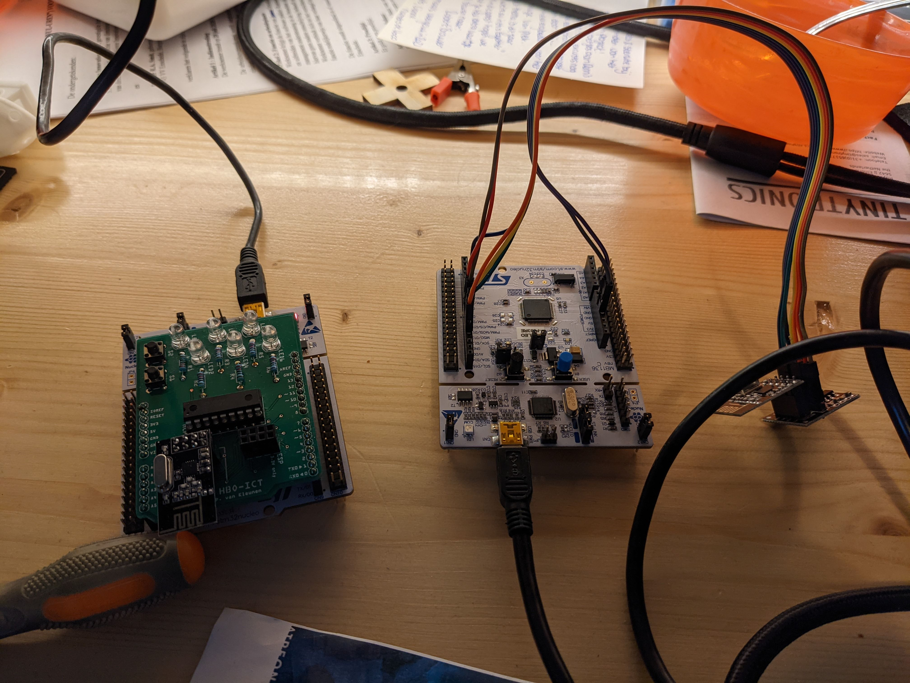

# Packet Error Rate App

The goal of the Packet Error Rate app is to measure the packet error rate when sending a number of messages when varying the output power for sending, the frequency channels, data rates and Auto Retransmit settings.

Unfortunately we did not succeed in getting the nrf24l01+ running with a nucleo. We got it working in Arduino within 10 minutes but with the Nucleo it was impossible for us. We have put in a lot of work, but we did not manage to get it working. Half way through we found out that the `enableAutoAcknowledge()` function of the libary is broken and breaks the radio. But even with our current code it is not possible to recieve messages. Although the code claims several bytes have been sent it is theoretically not possible timing wise. It should take 500 samples *4000 us* 15 retries = 30 seconds when there is no reciever, but it takes only a fraction of that. We can not find out what we are doing wrong, and it is so easy in Arduino.

[/nrf24-packet-error-rate](https://github.com/RubenSmit/wireless-communication/tree/main/nrf24-packet-error-rate/PacketErrorRAte)

