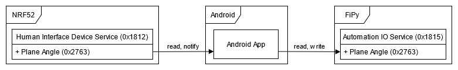
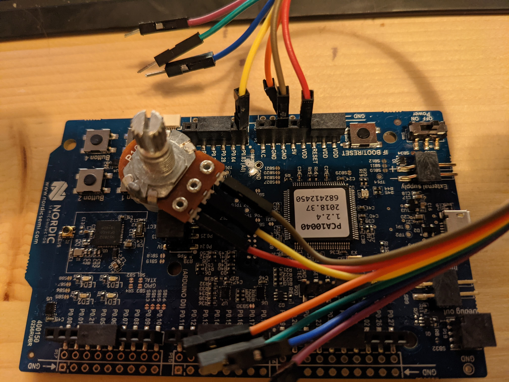
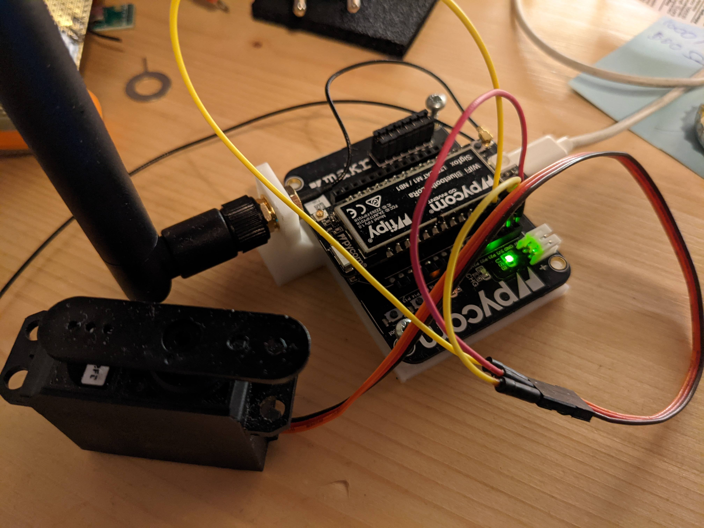

# System documentation - High level Radio
This documentation describes our high level radio project in which we demonstrate Bluetooth Low Energy (BLE) communication between three different devices. First we will describe the goal of our system. Next the roles of the different devices are described followed by the services and characteristics used in the BLE communciation. We also note how to use the system and the inner workings of the code is explained. Finally some demonstrations of the working system are shown and how we tested the system.

## System Goal
The goal of this system is to send the current angle of a potentiometer to an android application where it is displayed on a dashboard. From this dashboard it should be possible to control the angle of a servo motor, the angle of the servo should be shown on the dashboard. It should also be possible to link the angle of the servo motor to the angle of the potentiometer.

## Roles of of the Devices
The system will consist of three devices: a NRF52, a Android phone and a FiPy. Each of these devices will have a different role and task in the system which will be described below.

### NRF52
The NRF52 will act as a BLE Peripheral. A potentiometer will be attached to the NRF52 and the angle of this potentiometer can be read by a connected central.

### FiPy
The FiPy will act as a BLE Peripheral. It will be attached to a servo and the current angle of this servo can be read by a connected central. It will also be possible to set a new angle for the servo.

### Android phone
On the android phone a appplication will run that displays a dashboard. It will function as a BLE Central and connect to NRF52 and FiPy peripherals. It wil read the angle of the potentiometers of connected NRF52 peripherals and display those on the dashboard. When the angle of a potentiometer changes the dashboard is updated. The current angle of the servos of connected FiPy peripherals is also displayed. Using the dashboard the angle of the servos can be changed.

## Services and Characteristics
Both peripheral types expose a BLE service with a characteristic, the Android phone connects to these peripherals and uses these services and characteristics. A description will be given of the services and characteristics available from each peripheral and whether you can read, write or be notified for each characteristic. A overview of the different services and characteristics and how they are used is shown in the figure below.

### NRF52
- **Service: Human Interface Device (0x1812)**
This service was chosen because the NRF52 acts like a special kind of HID (Human Interface Device). It takes human input and makes it available to connected devices. 
- **Characteristic: Plane angle (0x2763)**
This characteristic was chosen because we are looking for the plane angle to set the servo to. And we read the angle (resistance) of the potentiometer to get it. The angle is sent in degrees.
    + **Read** The current angle of the potentiometer can be read.
    + **Notify** When the angle of the potentiometer changes connected devices can be notified.

### FiPy
- **Service: Automation IO (0x1815)**
This service was chosen because we are altering the IO of the fipy.
- **Characteristic: Plane angle (0x2763)**
This was chosen because we are setting the plane angle of the servo. The angle is send and set in degrees.
    + **Read** The current angle of the servo can be read.
    + **Write** The angle of the servo can be changed by writing a new value.

### Android phone
The Android phone does not expose any services and characteristics. It does however read the angle of connected NRF52 peripherals and subscribes to notifications in changes to this angle. It also reads the angles of connected FiPy peripherals and writes a new angle if needed.

## System Usage
The following chapter will describe how the system can be used. First we descibe how each component of the system, the NRF52, FiPy and Android phone, must be prepared. Next we show how all components can be used together and how the dashboard can be used.

### Preparing the NRF52
Follow the following steps to prepare the NRF52 with the attached potentiometer to be used as a Human Interface Device.

#### Bill of materials
The following materials are needed:

- Nordic-nRF52-DK
- 10K Ohm potentiometer
- 3 Jumper wires male-female

#### Connecting the materials
Connect the potentiometer to the NRF50 according to the following schematic. In the image below a example is shown of how these are connected.

| NRF52 pin | Potentiometer pin |
|-----------|-------------------|
| VDD       | Fixed end (P1)    |
| A0        | Wiper (P2)        |
| GND       | Fixed end (P3)    |

#### Uploading the code
Upload the code found in [/nrf52](https://github.com/RubenSmit/wireless-communication/tree/main/nrf52) to the NRF52 using Visual Studio Code with the PlatformIO plugin.

### Preparing the FiPy
Follwo the following steps to prepare the FiPy with the attached servo to be used as a Automation IO device.

#### Bill of materials
The following materials are needed:

- FiPy with Expansion board
- Servo motor
- 5V 500mA External power supply
- Breadboard
- 7 Jumper wires male-male

#### Connecting the materials
Connect the servo to the FiPy and the power supply on the breadboard according to the following schematic. In the image below a example is shown of how these are connected.

| FiPy pin | Servo pin | External power supply (5V 500mA) |
|----------|-----------|----------------------------------|
|          | 5v        | Positive                         |
| P23      | Signal    |                                  |
| GND      | GND       | Negative                         |

#### Uploading the code
Upload the code found in [/fipy](https://github.com/RubenSmit/wireless-communication/tree/main/fipy) to the FiPy using Visual Studio Code with the Pycom plugin.

### Preparing the Android phone
To use a Android phone as central with dashboard in the system, upload the code found in [/android](https://github.com/RubenSmit/wireless-communication/tree/main/android) to a Android phone using Android studio.

### Operation
To use the system follow the following steps:

1. Make sure all peripherals are turned on and prepared correctly.
2. Open the application on the Android phone
3. Press the big bluetooth button in the bottom right corner. The android device will now find and connect to all available peripherals. Please grant access to bluetooth and location services if requested.
4. A list of available peripherals and their status is shown once they are connected as can be seen in the image below.

For each connected NRF52 a bar is shown displaying the current angle of the potentiometer. When the potentiometer is turned this bar is updated. Every connected FyPi is also shown in the list. It is possibe to set the angle of the FyPi using the slider. Using the source dropdown it is possible to connect the angle of the servo to the angle of a potentiometer. When the potentiometer is turned the angle of the servo will be matched.

## Code
TODO

## Demonstrations and tests
TODO

### Full app demo
[app-demo.mp4](app-demo.mp4)

### Fipy with phone demo
[fipy-with-phone-demo.mp4](fipy-with-phone-demo.mp4)

### NRF52 with phone demo
[NRF52-with-phone-demo.mp4](NRF52-with-phone-demo.mp4)