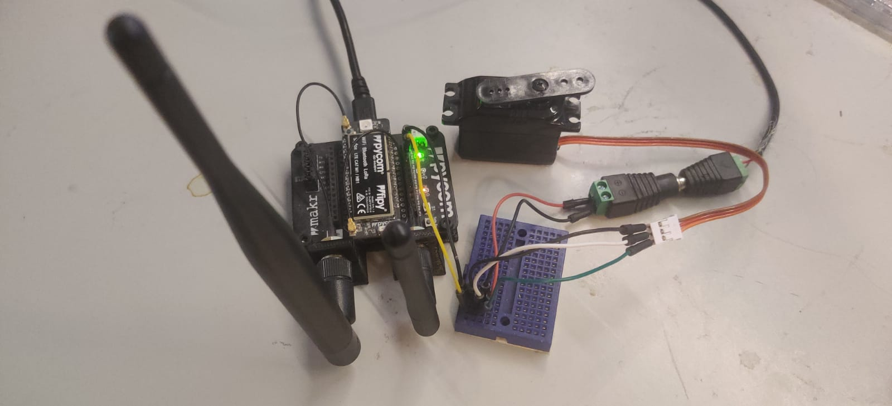
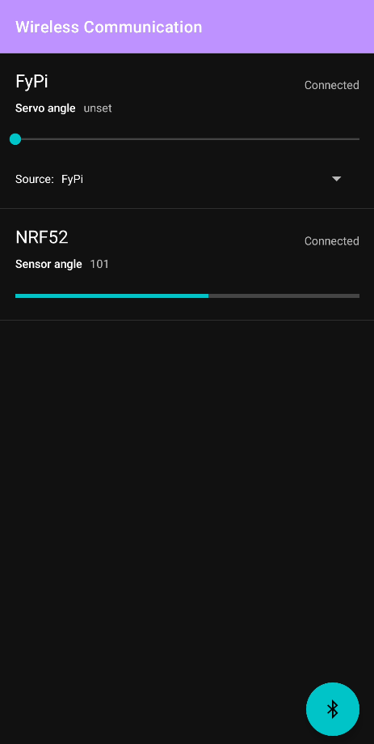

# System documentation - High level Radio
This documentation describes our high level radio project in which we demonstrate Bluetooth Low Energy (BLE) communication between three different devices. First we will describe the goal of our system. Next the roles of the different devices are described followed by the services and characteristics used in the BLE communciation. We also note how to use the system and the inner workings of the code is explained. Finally some demonstrations of the working system are shown and how we tested the system.

## System Goal
The goal of this system is to send the current angle of a potentiometer to an android application where it is displayed on a dashboard. From this dashboard it should be possible to control the angle of a servo motor, the angle of the servo should be shown on the dashboard. It should also be possible to link the angle of the servo motor to the angle of the potentiometer.

## Roles of of the Devices
The system will consist of three devices: a NRF52, a Android phone and a FiPy. Each of these devices will have a different role and task in the system which will be described below.

### NRF52
The NRF52 will act as a BLE Peripheral. A potentiometer will be attached to the NRF52 and the angle of this potentiometer can be read by a connected central.

### FiPy
The FiPy will act as a BLE Peripheral. It will be attached to a servo and the current angle of this servo can be read by a connected central. It will also be possible to set a new angle for the servo.

### Android phone
On the android phone a appplication will run that displays a dashboard. It will function as a BLE Central and connect to NRF52 and FiPy peripherals. It wil read the angle of the potentiometers of connected NRF52 peripherals and display those on the dashboard. When the angle of a potentiometer changes the dashboard is updated. The current angle of the servos of connected FiPy peripherals is also displayed. Using the dashboard the angle of the servos can be changed.

## Services and Characteristics
Both peripheral types expose a BLE service with a characteristic, the Android phone connects to these peripherals and uses these services and characteristics. A description will be given of the services and characteristics available from each peripheral and whether you can read, write or be notified for each characteristic. A overview of the different services and characteristics and how they are used is shown in the figure below.


### NRF52
- **Service: Human Interface Device (0x1812)**
This service was chosen because the NRF52 acts like a special kind of HID (Human Interface Device). It takes human input and makes it available to connected devices. 
- **Characteristic: Plane angle (0x2763)**
This characteristic was chosen because we are looking for the plane angle to set the servo to. And we read the angle (resistance) of the potentiometer to get it. The angle is sent in degrees.
    + **Read** The current angle of the potentiometer can be read.
    + **Notify** When the angle of the potentiometer changes connected devices can be notified.

### FiPy
- **Service: Automation IO (0x1815)**
This service was chosen because we are altering the IO of the fipy.
- **Characteristic: Plane angle (0x2763)**
This was chosen because we are setting the plane angle of the servo. The angle is send and set in degrees.
    + **Read** The current angle of the servo can be read.
    + **Write** The angle of the servo can be changed by writing a new value.

### Android phone
The Android phone does not expose any services and characteristics. It does however read the angle of connected NRF52 peripherals and subscribes to notifications in changes to this angle. It also reads the angles of connected FiPy peripherals and writes a new angle if needed.

## System Usage
The following chapter will describe how the system can be used. First we descibe how each component of the system, the NRF52, FiPy and Android phone, must be prepared. Next we show how all components can be used together and how the dashboard can be used.

### Preparing the NRF52
Follow the following steps to prepare the NRF52 with the attached potentiometer to be used as a Human Interface Device.

#### Bill of materials
The following materials are needed:

- Nordic-nRF52-DK
- 10K Ohm potentiometer
- 3 Jumper wires male-female

#### Connecting the materials
Connect the potentiometer to the NRF50 according to the following schematic. In the image below a example is shown of how these are connected.

| NRF52 pin | Potentiometer pin |
|-----------|-------------------|
| VDD       | Fixed end (P1)    |
| A0        | Wiper (P2)        |
| GND       | Fixed end (P3)    |


#### Uploading the code
Upload the code found in [/nrf52](https://github.com/RubenSmit/wireless-communication/tree/main/nrf52) to the NRF52 using Visual Studio Code with the PlatformIO plugin.

### Preparing the FiPy
Follwo the following steps to prepare the FiPy with the attached servo to be used as a Automation IO device.

#### Bill of materials
The following materials are needed:

- FiPy with Expansion board
- Servo motor
- 5V 500mA External power supply
- Breadboard
- 7 Jumper wires male-male

#### Connecting the materials
Connect the servo to the FiPy and the power supply on the breadboard according to the following schematic. In the image below a example is shown of how these are connected.

| FiPy pin | Servo pin | External power supply (5V 500mA) |
|----------|-----------|----------------------------------|
|          | 5v        | Positive                         |
| P23      | Signal    |                                  |
| GND      | GND       | Negative                         |



#### Uploading the code
Upload the code found in [/fipy](https://github.com/RubenSmit/wireless-communication/tree/main/fipy) to the FiPy using Visual Studio Code with the Pycom plugin.

### Preparing the Android phone
To use a Android phone as central with dashboard in the system, upload the code found in [/android](https://github.com/RubenSmit/wireless-communication/tree/main/android) to a Android phone using Android studio.

### Operation
To use the system follow the following steps:

1. Make sure all peripherals are turned on and prepared correctly.
2. Open the application on the Android phone
3. Press the big bluetooth button in the bottom right corner. The android device will now find and connect to all available peripherals. Please grant access to bluetooth and location services if requested.
4. A list of available peripherals and their status is shown once they are connected as can be seen in the image below.



For each connected NRF52 a bar is shown displaying the current angle of the potentiometer. When the potentiometer is turned this bar is updated. Every connected FyPi is also shown in the list. It is possibe to set the angle of the FyPi using the slider. Using the source dropdown it is possible to connect the angle of the servo to the angle of a potentiometer. When the potentiometer is turned the angle of the servo will be matched.

## Code
For every device a program has been written to enable the communication between the various components, connect the sensors and actuators and to display their status on the dashboard. Next we will explain how the code for each device works.

### NRF52
The code for the NRF52 consists of a main function and a Human Interface Device service class and can be found in [/nrf52/src/main.cpp](https://github.com/RubenSmit/wireless-communication/tree/main/nrf52/src/main.cpp).

#### Main function
On boot the main function is called. This function starts all services and is shown below.
```c++
int main() {
    BLE &ble_interface = BLE::Instance();
    events::EventQueue event_queue;
    HidService hid_service;
    BLEProcess ble_process(event_queue, ble_interface);
 
    ble_process.on_init(callback(&hid_service, &HidService::start));
 
    // bind the event queue to the ble interface, initialize the interface
    // and start advertising
    ble_process.start();
 
    // Process the event queue.
    event_queue.dispatch_forever();
 
    return 0;
}
```
First a instance of the ble interface and a event queue is created. Next a instance of the human interface device (HID) service is created. A bluetooth low energy process is created and the event queue and bluetooth interface are attached to it. When the bluetooth process is initiated the HID service is started. We start advertising and continue processing the event queue as long as the application is running.

#### Human Interface Device Service
The Human Interface Device Service manages the HID service and the angle characteristic for the GATT server.

```c++
void start(BLE &ble_interface, events::EventQueue &event_queue)
{
      if (_event_queue) {
        return;
    }

    _server = &ble_interface.gattServer();
    _event_queue = &event_queue;

    // register the service
    printf("Adding service\r\n");
    ble_error_t err = _server->addService(_hid_service);

    if (err) {
        printf("Error %u during service registration.\r\n", err);
        return;
    }

    // read write handler
    _server->onDataSent(as_cb(&Self::when_data_sent));
    _server->onDataRead(as_cb(&Self::when_data_read));

    // updates subscribtion handlers
    _server->onUpdatesEnabled(as_cb(&Self::when_update_enabled));
    _server->onUpdatesDisabled(as_cb(&Self::when_update_disabled));

    // print the handles
    printf("human interface device service registered\r\n");
    printf("service handle: %u\r\n", _hid_service.getHandle());
    printf("\angle characteristic value handle %u\r\n", _angle_char.getValueHandle());

    _event_queue->call_every(1000 /* ms */, callback(this, &Self::read_angle));
    _event_queue->call_every(1000 /* ms */, callback(this, &Self::blink_led));
}
```

When the service is started it registers the hid service to the GATT server. Next it registers the handlers for sending and reading data and enabling and disabling of updates. Two events are added to the event queue to be run every second, reading the angle of the potentiometer and blinking the heartbeat led.

```c++
void read_angle(void)
{
    uint8_t angle = (uint8_t) map(_angle_sensor.read(), 0, 1, 0, 180);
    printf("read angle as %i\r\n", angle);

    ble_error_t err = _angle_char.set(*_server, angle);
    if (err) {
        printf("write of the angle value returned error %u\r\n", err);
        return;
    }
}
```

After reading the angle it is mapped to a value of 0 to 180 degrees. Then the angle characteristic is updated with the new angle and any subscribers are notified.

### FiPy
The code for the FiPy can be found in [/fipy/src/main.cpp](https://github.com/RubenSmit/wireless-communication/tree/main/fipy/src/main.cpp).

```python
bluetooth = Bluetooth() # Get a bluetooth instance
bluetooth.set_advertisement(name='FyPi') # Set the name
bluetooth.callback(trigger=Bluetooth.CLIENT_CONNECTED | Bluetooth.CLIENT_DISCONNECTED, handler=conn_cb) # set up the callbacks for connect and disconnect events
bluetooth.advertise(True) # advertise the device
```

When the FiPy is booted a bluetooth instance is created and prepared for advertisement and started. Also connection and disconnection callbacks are added.

```python
srv1 = bluetooth.service(uuid=0x1815 , isprimary=True) # set up the service to display the current angle of the servo
chr1 = srv1.characteristic(uuid=0x2763 , value=currentAngle) # set up the characteristic to get the server angle 
char1_cb = chr1.callback(trigger=Bluetooth.CHAR_WRITE_EVENT, handler=char1_cb_handler) # set up the callback when writen to characteristic
```

Next the Automation IO service is created and a angle characteristic is added to the service. A callback is created to handle write events to the angle characteristic.

```python
pwm = PWM(0, frequency=50) # make a pwm provider
servo = pwm.channel(0, pin='P23', duty_cycle=0.0) # Setup the pwm for the servo
setServoPwn(currentAngle) # Set the servo the the initial angle
```

Finally a Pulse With Modulation (PWM) provider is created with a channel to control the servo. The correct pwm value is determined for the current angle and the servo is moved to the initial angle.

```python
def char1_cb_handler(chr, data): 
    events, value = data # store the events and data
    if  events & Bluetooth.CHAR_WRITE_EVENT: # if the event was a write event
        currentAngle = int.from_bytes(value, "big") # get the value from the payload
        setServoPwn(currentAngle) # set the servo to the right position
        chr1.value(currentAngle) # update the value that is displayed over Bluetooth
        print("Set new angle: ", currentAngle)
```
When a write event occurs for the angle characteristic it is handled by the event handler. The new angle is read from the payload and stored. A new pwm value for the servo is calculated and the servo is moved to the right position. Finally the characteristic is updated with the new angle value.

### Android
The android application consists of several components. First a global overview will be given of these components and their relation. Next each component will be described in detail. The components of the application are:

- **Main Activity** Is started when the application boots. It initializes all other components of the application and manages the bluetooth connections and scanning.
- **Device Model** Stores all information about and handles the communication with a single peripheral.
- **Bluetooth Devices Provider** Stores and manages a list of all connected peripherals.
- **Bluetooth Devices List Adapter** Handles the displaying of the list of connected peripherals.

When the Main Activity is started and the bluetooth connection button is pressed the Android phone will start scanning for available peripherals. Once a peripheral is found a Device Model is created for the peripheral and stored in the Bluetooth Devices Provider.

The Main Activity will supply the Bluetooth Devices List Adapter with the list of devices to be displayed. When a new device is found the Main Activity will notify the List Adapter of the change. When a property of a device changes it wil notify the Main Activity which in turn will notify the List Adapter. In this way all changes to the devices will be displayed in the list.

#### Main Activity
When the Main Activity is started the `onCreate` method is called. It contains the following code.

```java
// Initializes Bluetooth adapter.
final BluetoothManager bluetoothManager =
        (BluetoothManager) getSystemService(Context.BLUETOOTH_SERVICE);
bluetoothAdapter = bluetoothManager.getAdapter();

// Ensures Bluetooth is available on the device and it is enabled. If not,
// displays a dialog requesting user permission to enable Bluetooth.
if (bluetoothAdapter == null || !bluetoothAdapter.isEnabled()) {
    Intent enableBtIntent = new Intent(BluetoothAdapter.ACTION_REQUEST_ENABLE);
    startActivityForResult(enableBtIntent, REQUEST_ENABLE_BT);
}

bluetoothDevicesListAdapter = new BluetoothDevicesListAdapter(this);

FloatingActionButton fab = findViewById(R.id.fab);
fab.setOnClickListener(new View.OnClickListener() {
    @Override
    public void onClick(View view) {
        scanLeDevice();
    }
});
```

In it the Bluetooth manager and adapter are initialized. We ensure bluetooth is enabled and permission is given to use the bluetooth services. Next the List Adapter is initialized for displaying the list of connected peripherals. A listner is created for the floating action button that, when the button is pressed, starts scanning for bluetooth devices.

```java
private void scanLeDevice() {
    Log.i(TAG, "Started scanning for devices");
    BluetoothDevicesProvider.clear();
    if (!mScanning) {
        // Stops scanning after a pre-defined scan period.
        handler.postDelayed(new Runnable() {
            @Override
            public void run() {
                mScanning = false;
                bluetoothLeScanner.stopScan(leScanCallback);
                Log.i(TAG, "Stopped scanning for devices");
            }
        }, SCAN_PERIOD);

        // Scan for devices matching the filter and use the callback for found devices
        mScanning = true;
        List<ScanFilter> filters = deviceFilters();
        ScanSettings settings = new ScanSettings.Builder().setScanMode(ScanSettings.SCAN_MODE_LOW_LATENCY).build();
        bluetoothLeScanner.startScan(filters, settings, leScanCallback);
    } else {
        // Stop scanning if the button is pressed again
        mScanning = false;
        bluetoothLeScanner.stopScan(leScanCallback);
        Log.i(TAG, "Stopped scanning for devices");
    }
}
```

When the scanning is started a delayed handler is created that will stop the scanning after a predefined period. A filter is applied to the scanner to only return NRF52 and FiPy devices. Also a callback is defined to handle any found devices.

```java
private ScanCallback leScanCallback =
        new ScanCallback() {
            @Override
            public void onScanResult(int callbackType, ScanResult result) {
                // Get the bluetooth device
                Log.i(TAG, "Found a bluetooth device!");
                super.onScanResult(callbackType, result);
                BluetoothDevice bluetoothDevice = result.getDevice();

                if (!BluetoothDevicesProvider.contains(bluetoothDevice.getAddress())) {
                    // Add the device to the list and observe it
                    Log.i(TAG, "Adding new device to list");
                    Device device = new Device(bluetoothDevice, getContext());
                    BluetoothDevicesProvider.addDevice(device);
                    device.addObserver(getObserver());
                }
            }
        };
```

The scan callback creates a Device model for each found device and adds it to the Bluetooth Devices Provider. Also the Main Activity is adde as a observer to the Device model.

```java
public void update(Observable observable, Object o) {
    runOnUiThread(new Runnable() {
        @Override
        public void run() {
            int index = BluetoothDevicesProvider.deviceList.indexOf((Device) observable);
            bluetoothDevicesListAdapter.notifyItemChanged(index);
        }
    });
}
```

When there are changes to a Device model the Main Activity, as observer, is notified. Consequently it will start a runner on the UI thread to notify the List Adapter about changes to the item.

#### Device Model
```java
public Device(BluetoothDevice bluetoothDevice, Context context) {
    this.device = bluetoothDevice;
    this.context = context;

    Log.i(TAG, "Attempt connecting to gatt service.");
    bluetoothGatt = device.connectGatt(context, false, gattCallback);
}
```

When created the Device model stores the bluetooth device and attempts to connect to the gatt service of the device. The gatt callback handles the events that emanate from the gatt service. The following events are handled:

- **onConnectionStateChange** When the connection state is changed is is stored and all observers are notified and a attempt is made to discover the services.
- **onServicesDiscovered** When services are discovered a attempt is made to determine the service type.
- **onCharacteristicChanged** When a notification is recieved that a characteristich has changed a attempt is made to read the characteristic.
- **onCharacteristicRead** When the angle characteristic is read the format of the data is determined and the angle is stored.
- **onCharacteristicWrite** When a characteristic is successfully written this is logged.

```java
private void setServiceType(BluetoothGatt gatt) {
    for (BluetoothGattService service: gatt.getServices()) {
        UUID uuid = service.getUuid();
        Log.i(TAG, "Found service: " + uuid + " for device: " + device.getName());
        if (uuid.equals(UUID_HUMAN_INTERFACE_DEVICE_SERVICE)) {
            // If the device is a sensor, subscribe to new sensor data
            Log.i(TAG, "This is a sensor!");
            deviceType = TYPE_SENSOR;
            subscribeToSensorData(service);
        } else if (uuid.equals(UUID_GENERIC_ATTRIBUTE_SERVICE)) {
            Log.i(TAG, "This is a servo!");
            deviceType = TYPE_SERVO;
        }
    }
}
```

When a service is detected it is matched against the sensor and servo service UUIDs. When a match is found the device type is stored. For sensors a attempt is made to subscribe to the sensor data.

```java
private void subscribeToSensorData(BluetoothGattService service) {
    for (BluetoothGattCharacteristic characteristic: service.getCharacteristics()) {
        Log.i(TAG, "Found characteristic: " + characteristic.getUuid() + " for device: " + device.getName());
    }

    BluetoothGattCharacteristic characteristic = service.getCharacteristic(UUID_PLANE_ANGLE_CHARACTERISTIC);
    bluetoothGatt.setCharacteristicNotification(characteristic, true);
    BluetoothGattDescriptor descriptor = characteristic.getDescriptor(CLIENT_CHARACTERISTIC_CONFIG);
    descriptor.setValue(BluetoothGattDescriptor.ENABLE_NOTIFICATION_VALUE);
    bluetoothGatt.writeDescriptor(descriptor);

    Log.i(TAG, "Subscribed to sensor characteristic: " + characteristic);

    bluetoothGatt.readCharacteristic(characteristic);
}
```

When subscribing to the sensor data the angle characteristic is retrieved and the bluetooth gatt server of the android phone is instructed to subscribe to notifications for the characteristic. Next a attempt is made to read the angle characteristic.

```java
private void setAngle(int angle) {
    if (angle != this.angle) {
        this.angle = angle;
        setChanged();
        notifyObservers();
    }
}
```

When a new angle is stored and it differs from the previous angle, the observers of the Device model are notified.

```java
public void writeAngle(int angle, boolean notify) {
    if (angle != this.angle) {
        this.angle = angle;
        if (notify) {
            setChanged();
            notifyObservers();
        }
        Log.i(TAG, "Set angle to: " + angle);

        BluetoothGattService service = bluetoothGatt.getService(UUID_GENERIC_ATTRIBUTE_SERVICE);
        BluetoothGattCharacteristic characteristic = service.getCharacteristic(UUID_PLANE_ANGLE_CHARACTERISTIC);
        characteristic.setValue(angle, BluetoothGattCharacteristic.FORMAT_UINT8, 0);
        bluetoothGatt.writeCharacteristic(characteristic);
    }
}
```

When a new angle is written to a Device model a attempt is made to write it to the characteristic. If specified the observers of the model are notified of the change.

#### Bluetooth Devices Provider
```java
public static List<Device> deviceList;
public static Map<String, Device> deviceMap;
public static BluetoothDevicesListAdapter adapter;
```

The BluetoothDevicesProvider maintains a list of all connected devices. It also stores the instance of the devices list adapter that displays the list of devices so it can notify the adapter of any changes to the list.

```java
public static void addDevice(Device device) {
    if (!contains(device.getDeviceAddress())) {
        deviceList.add(device);
        deviceMap.put(device.getDeviceAddress(), device);
        adapter.notifyDataSetChanged();
    }
}
```

New devices can be added to the list and the adapter will be notified of the change.

```java
public static void clear() {
    for(Device device: deviceList) {
        device.disconnect();
    }

    deviceList.clear();
    deviceMap.clear();
    adapter.notifyDataSetChanged();
}
```

When the list with devices must be cleared each device is disconnected and the lists are cleared. The adapter is notified of the changes to the list.

#### Bluetooth Devices List Adapter
The list adapter displays a list containing three kinds of devices:

- Unknown devices where the service type is not yet determined.
- Sensor devices with a Human Interface Device service.
- Servo devices with a Automation IO service.

Each device type has its own view and view binder. In the `onCreateViewHolder` and `onBindViewHolder` functions the correct view and binder are determined.

```java
public int getItemViewType(int position) {
    Device device = BluetoothDevicesProvider.deviceList.get(position);

    if(device.getDeviceType() == SENSOR){
        return SENSOR;
    } else if (device.getDeviceType() == SERVO) {
        return SERVO;
    } else {
        return UNKNOWN;
    }
}
```

The view type is determined for the current list position by getting the device from the devices provider and matching the type.

##### Servo View
The servo view contains a seekbar to change the angle of the servo and a dropdown to select the source of the angle.

```java
holder.sbAngle.setOnSeekBarChangeListener(new SeekBar.OnSeekBarChangeListener() {
    @Override
    public void onProgressChanged(SeekBar seekBar, int i, boolean b) {
        if (!device.usesSource()) {
            device.writeAngle(seekBar.getProgress(), false);
            holder.tvAngle.setText(String.valueOf(seekBar.getProgress()));
        }
    }
```

The `OnSeekBarChangeListener` writes a new angle to the device when the position of the seekbar is changed.

```java
List<Device> sources = new ArrayList<>();
sources.add(device);
for (Device sourceDevice: BluetoothDevicesProvider.deviceList) {
    if (!sourceDevice.equals(device) && sourceDevice.getDeviceType() == SENSOR) {
        sources.add(sourceDevice);
    }
}
ArrayAdapter<Device> spinnerAdapter = new ArrayAdapter(context, R.layout.source_list_item, R.id.tvSourceName, sources.toArray());
holder.spSource.setAdapter(spinnerAdapter);
if (device.usesSource()) {
    holder.spSource.setSelection(sources.indexOf(device.getSource()));
}

holder.spSource.setOnItemSelectedListener(new AdapterView.OnItemSelectedListener() {
    @Override
    public void onItemSelected(AdapterView<?> adapterView, View view, int i, long l) {
        Device source = sources.get(i);
        if (source.equals(device)) {
            device.unsetSource();
        } else {
            device.setSource(source);
        }
    }
```

A list of available sources is created by getting all devices from the device provider and filtering them on device type. For each available source a dropdown item is created. The currently used source is pre-selected in the dropdown. When a item in the dropdown is selected the `OnItemSelectedListener` handles the event and sets the new source for the servo device.

## Tests
Three tests where preformed to validate the system.

### Potentiometer rotation test
For this test a Sensor peripheral and a Android phone running the application where used. The goal of the test was to determine if the angle of the potentiomenter on the peripheral was correctly displayed on the dashboard. Also tested was if the angle of the potentiometer was changed the dashboard was updated with the new angle in a timely manner.

The test proved to be successfull. The angle displayed on the dashboard matched the angle of the potentiometer and changes in the angle of the potentiometer where displayed correctly on the dashboard within a second.

### Servo rotation test
This test was preformed using a Servo peripheral and a Android phone running the application. The goal of the test was to determine if the angle of the servo matched the setting on the dashboard. Also tested was if the angle of the servo changed according to the input on the dashboard.

The test was successfull. The angle displayed matched the angle of the servo and when the angle was changed on the dashboard the servo quickly rotated to the new angle.

### Combined rotation test
During this test both a Sensor and Servo peripheral where used, as well as a Android phone running the application. The goal was to test if the angle of the servo would match the angle of the potentiometer when the sensor was selected as source for the servo on the dashboard.

It was possible to link the angle of the servo to the angle of the potentiometer during the tests. The tests where therefore successfull.

## Demonstrations
The following video's demonstrate the working system in several ways:

- **Full app demonstration** [app-demo.mp4](app-demo.mp4) displaying connecting sensors and servo's, displaying changes in angle of the sensor, changing the angle of the servo and linking the angle of the sensor to the servo.
- **Fipy with phone demonstration** [fipy-with-phone-demo.mp4](fipy-with-phone-demo.mp4) displaying controlling the angle of the servo using the app.
- **NRF52 with phone demonstration** [NRF52-with-phone-demo.mp4](NRF52-with-phone-demo.mp4) displaying changing the angle of the potentiometer and displaying the changes in the app.